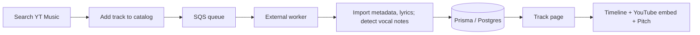

# NoteFinder

**Discover the vocal notes of your favorite songs — sing in tune, every time!**

Search a song, see which notes to sing and when, and practice with real-time pitch feedback.

## Screenshots


---

## What is NoteFinder?

It's hard to know which notes to sing and when; going off-pitch is easy. Apps like Yousician are paid and don't have every song.

NoteFinder lets you **search** via YouTube Music. If a track isn't in the catalog yet, it is added to a queue; a worker **imports** metadata and lyrics and **detects vocal notes**, which are then shown on a timeline. You play the song via **YouTube's embed** (we don't host the music), optionally turn on the mic, and see your pitch overlaid to stay in tune.

Transpose to your key, vocals-only when allowed, synced lyrics, and a shared catalog so everyone benefits from imported notes.

---

## How It Works

- **Search:** The app **searches** YouTube Music and checks which results are already in the DB.
- **Importing notes:** For new tracks, the app creates the record and enqueues a job. An **external worker imports** metadata and artwork, **imports** lyrics, **detects vocal notes**, and saves them.
- **Playback:** **YouTube embed**; the app reads the current time and syncs the notes timeline. For some tracks, when allowed (copyright), direct audio is used.



---

## Features

- **Vocal note timeline** – Pre-computed notes (pitch, start, end) for each processed track.
- **Real-time pitch detection** – Microphone input on the timeline (Pitchy).
- **Playback & practice** – **YouTube embed** (official API) for playback; when allowed, direct audio, transpose (± semitones), vocals-only, speed, mute.
- **Synced lyrics** – Word-level lyrics aligned to playback.
- **Search & import** – **Search** via YouTube Music; if the track is new, it is added to a queue; a worker **imports** metadata and **detects vocal notes**; async status and emails.
- **Copyright-aware** – The app does **not** host or reproduce music; playback is via **YouTube's embed**. Per-track rules for when direct audio/transpose/vocals-only are allowed; otherwise YouTube-only.
- **User accounts** – NextAuth (Google + email/password); profiles (added, favorites, recent views); section visibility.
- **Discovery** – Home sections and "trending today".
- **Track scoring** – Trigger.dev task from views and trends.
- **Mobile-friendly** – Fullscreen timeline, landscape hint, in-app browser handling.
- **SEO & performance** – Sitemaps, metadata, static params, cache tags, Cache Components.

---

## Tech Stack

- **Frontend:** Next.js 16 (App Router), React 19, Tailwind 4, Radix UI, react-hook-form, zod, Pitchy, Tone.js, react-youtube, Lottie, sonner.
- **Backend:** NextAuth 5, Prisma 7, PostgreSQL, AWS SQS (queue for **import** jobs), Trigger.dev v4 (score), Resend (email), S3 (avatars, **imported** artwork and lyrics).
- **Deploy:** GitHub Actions, Nixpacks, Docker, GHCR, Coolify.

---

## Getting Started

**Prerequisites:** Node.js 18+, pnpm, PostgreSQL. Optionally: AWS (SQS, S3), Trigger.dev, Resend, Notefinder YT Music API URL.

```bash
git clone https://github.com/theryston/notefinder.git
cd notefinder
pnpm install
```

Copy `.env.example` to `.env` and fill in your values (`DATABASE_URL`, `NEXTAUTH_SECRET`, `NOTEFINDER_YTMUSIC_API_URL`, S3, Resend, Trigger, etc.).

```bash
pnpm db:migrate
pnpm dev
```

**Note:** Full import of new tracks (metadata, lyrics, vocal notes) is done by an **external worker** that consumes the add-notes SQS queue and **imports** the data and **detects** vocal notes.

---

## Project Structure

- `app/` – App Router: home, search, tracks, users, auth (sign-in, sign-up, verify, forgot-password), me, terms.
- `app/api/` – Auth, stats, tracks (lyrics, notes, thumbnails, status, nfp-audio).
- `components/` – `timeline/` (viewport, pitch-line, use-pitch-detection, youtube-player, audio-player, controls, lyrics-display), `track-list`, `track-item`, UI.
- `lib/` – Prisma, constants, services (notefinder-ytmusic, s3, stats, track, users).
- `prisma/` – Schema, migrations.
- `trigger/` – `calculate-score` (Trigger.dev v4).

---

## Scripts

| Command | Description |
|---------|-------------|
| `pnpm dev` | Dev server |
| `pnpm build` | Production build |
| `pnpm start` | Production server |
| `pnpm db:migrate` | Prisma migrate dev |
| `pnpm db:studio` | Prisma Studio |
| `pnpm lint` | Lint |
| `pnpm format` | Prettier |

---

## Links

- [GitHub](https://github.com/theryston/notefinder) – Source code. Contributions are welcome.
- [Notefinder.com.br](https://notefinder.com.br) - The website
